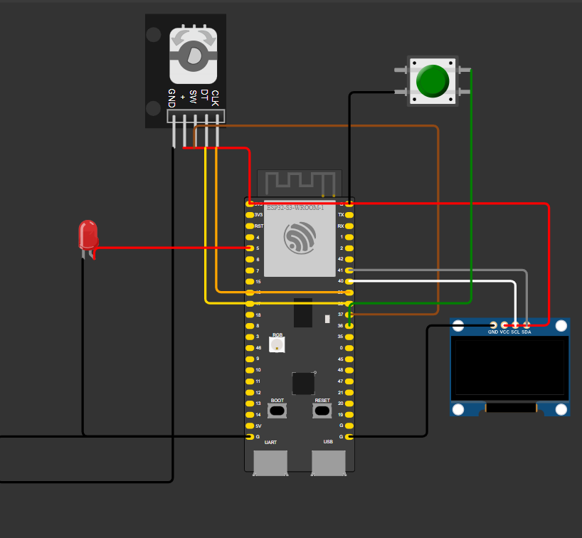

# Sistema de Encoder Rotativo con Display OLED y LED

Este proyecto utiliza un **ESP32** para medir la distancia recorrida mediante un **encoder rotativo**, mostrar la información en un **display OLED** y encender un **LED** cuando se alcanza una distancia objetivo configurable.

## Descripción del Funcionamiento

1. **Modo Normal**:
   - El sistema mide la distancia recorrida en milímetros utilizando el encoder rotativo.
   - La distancia se muestra en el display OLED.
   - Si la distancia supera el valor objetivo, el LED se enciende; de lo contrario, permanece apagado.

2. **Modo Configuración**:
   - Al presionar el botón de configuración, se accede al menú de configuración.
   - Se pueden ajustar dos parámetros:
     - **Milímetros por paso del encoder**.
     - **Distancia objetivo para encender el LED**.
   - Los valores configurados se guardan en la memoria persistente del ESP32.

3. **Reinicio**:
   - Al presionar el botón del encoder, el contador de distancia se reinicia a cero.

## Componentes Necesarios

- **ESP32** (modelo WROOM-32 o similar).
- **Encoder rotativo** con botón integrado.
- **Display OLED** (128x64 píxeles, protocolo I2C).
- **LED** con resistencia limitadora de corriente (330Ω recomendada).
- **Botón pulsador** para acceder al menú de configuración.
- Cables de conexión.

## Conexiones

| Componente         | Pin del ESP32 |
|---------------------|---------------|
| Encoder CLK         | GPIO 39       |
| Encoder DT          | GPIO 38       |
| Encoder SW (botón)  | GPIO 37       |
| Botón de configuración | GPIO 36    |
| OLED SDA            | GPIO 41       |
| OLED SCL            | GPIO 40       |
| LED                 | GPIO 5        |

## Diagrama de Conexión

A continuación, se muestra el diagrama de conexión del proyecto:

## Librerías Necesarias

Antes de cargar el código al ESP32, asegúrate de instalar las siguientes librerías en el **Arduino IDE**:

1. **Adafruit GFX Library**: Para manejar gráficos en el display OLED.
2. **Adafruit SSD1306**: Para controlar el display OLED.
3. **Preferences**: Para almacenamiento persistente en la memoria flash del ESP32.

Puedes instalar estas librerías desde el **Gestor de Librerías** del Arduino IDE.

## Instrucciones de Uso

1. Conecta los componentes al ESP32 según el diagrama de conexión.
2. Carga el código del archivo [`Encoder_Rotativo.ino`](Encoder_Rotativo.ino) al ESP32 utilizando el Arduino IDE.
3. Al encender el sistema:
   - El display mostrará un mensaje de bienvenida.
   - Entrará en el modo normal, mostrando la distancia medida.
4. Para acceder al menú de configuración:
   - Presiona el botón de configuración.
   - Usa el encoder para navegar por las opciones y ajustar los valores.
   - Presiona el botón del encoder para guardar los cambios.
5. Para reiniciar el contador de distancia:
   - Presiona el botón del encoder en el modo normal.

## Notas

- El sistema guarda automáticamente los valores configurados en la memoria persistente del ESP32, por lo que se mantendrán incluso después de reiniciar el dispositivo.
- Asegúrate de que el display OLED esté configurado para la dirección I2C `0x3C`.

¡Disfruta construyendo y utilizando este proyecto!